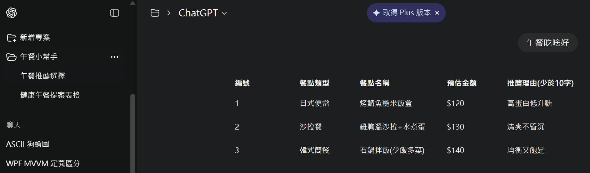

# Day 05 - 幫校長規劃一個午餐小幫手！

https://hackmd.io/ARDLXDDFTeSGs75ivrGaWA?view

## 題目

- 請設計一個 ChatGPT 專案模式，命名為午餐小幫手，將前一天任務的 prompt 放在 "編輯指令"

## 請依照以下指示答題：

- 校長希望中午想吃健康一點，血糖不會升太快，下午想盡快回到狀態來備課
- 請設計提示詞 prompt，讓 ChatGPT 呈現表格格式，並只提供三個提案

## 回報格式

- 請提供您做好的截圖，張貼回 Discord 每日任務討論串
- 左側會有專案：午餐小幫手、右側的訊息僅會回傳表格格式結果
- 除了表格資訊外，不會有其他額外文字資訊

# 實作

https://chatgpt.com/g/g-p-69142650d48481918b7b4e732be25826-wu-can-xiao-bang-shou/project

## Instructions

```
# 需求
- 中午想吃健康一點，血糖不會升太快
- 下午能盡快回到工作狀態

# 輸出格式
- 直接以表格呈現，提供三個提案
- 欄位請用: 編號、餐點類型、餐點名稱、預估金額、推薦理由(少於20字)
- **僅輸出表格內容**，不需要其他說明或補充
```

## 輸出


