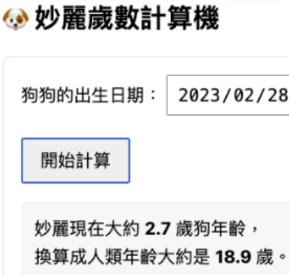

# Day 08 - 除了 HTML、CSS，還有 JS

https://hackmd.io/IoEEmy5HQJemSba1i94o5A?view

## 題目

- 狗狗歲數計算機
- 輸入狗狗出生年月日後顯示
- 狗狗的年齡是幾歲
- 換算成人類的年齡是幾歲
- 需參考真實人狗年齡換算文獻
- 期望的介面如下



## 回報格式

- 請提供您的人狗換算歲數文獻來源
- 您的 Codepen、GitHub Pages 網址操作
- 您設計的 prompt

# 實作

- Windows Terminal
- Windows Subsystem Linux
- Claude Code
- Speckit

```sh
wsl --update
npm i -g npm@latest
npm i -g @anthropic-ai/claude-code
uv tool upgrade specify-cli
```

```sh
# make sure in the project directory
specify init .
# into wsl
wsl
sudo apt update
claude --dangerously-skip-permissions
```

## 結果

文獻

https://www.cell.com/cell-systems/fulltext/S2405-4712(19)30464-8?_returnURL=https%3A%2F%2Flinkinghub.elsevier.com%2Fretrieve%2Fpii%2FS2405471219304648%3Fshowall%3Dtrue

Codepen

https://codepen.io/snijqlte-the-bold/pen/XJdXybz

GitHub Pages

https://dpi627.github.io/HexVC3DailyTask08/

GitHub Repo (with rich readme.md)

https://github.com/dpi627/HexVC3DailyTask08

ChatGPT chat

https://chatgpt.com/share/6916af4e-c110-800c-af2f-b9718655078b

Prompt

```
設計一個單頁靜態網站，符合以下需求 
- 狗狗歲數計算機 
- 輸入狗狗出生年月日後顯示 
- 狗狗的年齡是幾歲 
- 換算成人類的年齡是幾歲 
- 需參考真實人狗年齡換算文獻 - 期望的介面如圖 
- 只使用一個 index.html 
- 樣式表單獨放在 style.css 
- 程式碼單圖放在 lib.js 
- 不使用任何第三方套件與函式庫 
- 需要能直接貼到 CodePen 執行 
- 需要能直接部署到 GitHub Pages 
- 需搜尋至少一份人狗年齡換算文獻作為參考 
- 文獻來源需顯示於網頁下方 
- 使用原生 css 語法進行網頁設計，呈現現代化設計並具備良好 UX 
- 請分別輸出 html, css 與 js
```