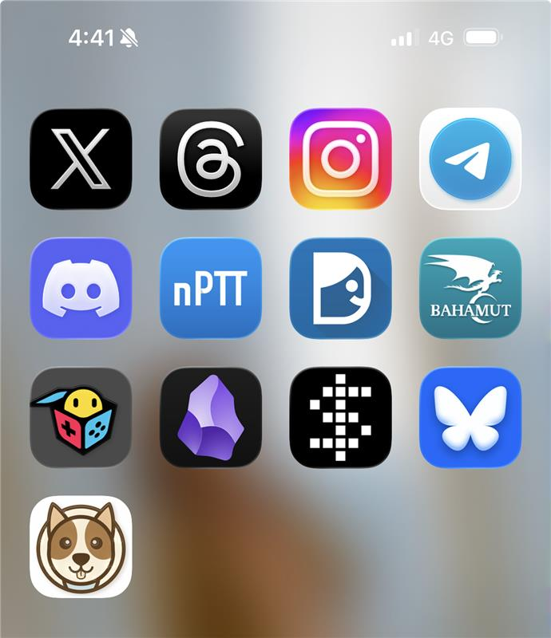

# Day 13 - 讓狗狗年齡計算器變成「快捷網頁 App」

## 題目

- 準備一張 icon.png，放在 index.html 同一層
- 在 <head> 中加入三行 <link> 語法
- 部署到 GitHub Pages
- 在手機主畫面建立這個網頁的快捷 App

```html
<head>
<!--  放入這三行開始 -->
<link rel="icon" type="image/png" href="./icon.png">
<link rel="apple-touch-icon" href="./icon.png">
<link rel="apple-touch-icon" sizes="180x180" href="./icon.png">
<!--  放入這三行結束 -->
</head>
```

## 回報格式

- GitHub Pages 網址
- 有 icon 的手機畫面截圖
- 分享過程中有沒有遇到一些困難，並嘗試 Vibe 或研究解決

# 實作

- Create icon from Google AI Studio


## 結果

GitHub Pages

https://dpi627.github.io/HexVC3DailyTask08/

GitHub Repo (with rich readme.md)

https://github.com/dpi627/HexVC3DailyTask08

