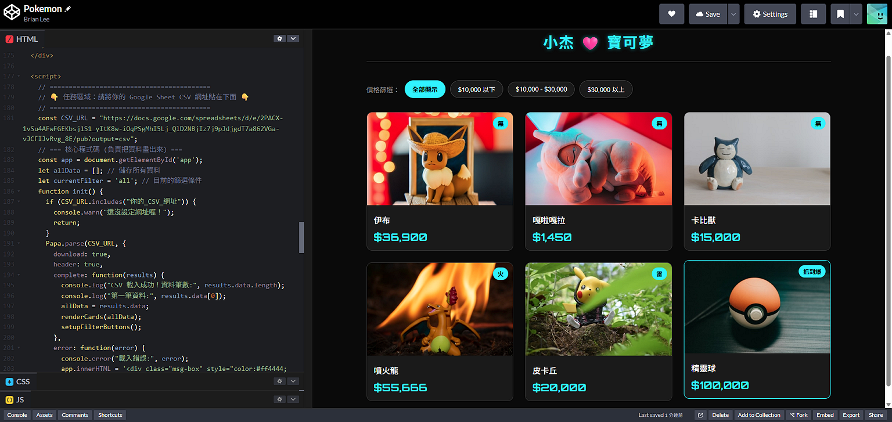

# Day 18 - Google Sheet as Database

參考 [範例](https://codepen.io/liao/pen/VYazgBd)，底層使用 Google Sheet 作為資料庫

# 任務

## 建立資料副本

- 開啟 [Google 試算表](https://docs.google.com/spreadsheets/d/1wiQJvbEj65ORHbY68CM-PZqnIhy7ZdI5Ci-KFZfiiDU/edit?gid=1023600832#gid=1023600832)，建立副本到自己 Google 雲端
- 編輯試算表，嘗試修改或新增資料，完成後進行發布

## 發布資料來源

- 檔案 > 共用 > 發佈到網路 > 格式選擇 CSV
- 複製發布後的網址

## 前端串接

- 開啟 [CodePen](https://codepen.io/liao/pen/VYazgBd) 範例，fork 到自己 CodePen
- 找到程式中的 `const CSV_URL = "..."`，使用上個步驟的連結取代
- 前端會呈現資料來源商品

> [!TIP] 
> 除了 CodePen，也可使用 GitHub Pages

# 作業

- 請使用 CodePen / GitHub Pages 實作，並完成資料串接
- 可以任意改主題跟商品資訊，調整自己喜歡的樣子
- 請至少加入一筆「價格破十萬」的夢幻逸品，並給予一個吸引人的 tag
- 驗證網頁能正確顯示所有商品、圖片和價格
- 過程均可 Vibe Coding，不限任何 AI 服務

# 回報格式

- CodePen / GitHub Pages 網址
- 截圖網頁畫面，證明成功讓商品上架

# 結果

- [CodePen](https://codepen.io/snijqlte-the-bold/pen/EaKoxow)

